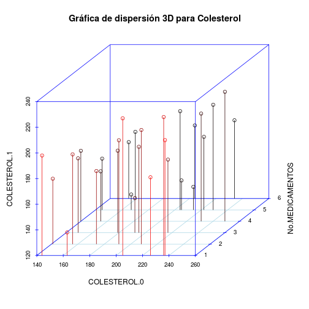

Examen Final del  Curso Optativo de Análisis Cuantitativo de Datos
Problema 2: Análisis de datos en un entorno multivariado  
Código para reproducir gráficas del Problema 2
========================================================


```r

## Carga los datos del examen en 'DATOS_EX'
url = "http://metropolis-it.com/files/Statistics/DATOS_EX.txt"
DATOS_EX <- read.csv(url, sep = ",", header = TRUE)

attach(DATOS_EX)
DATOS_EX
```

```
##    NUMERO EDO_CIVIL EDAD TALLA IMC.0 IMC.1 ESCOLARIDAD SISTOLE.0 SISTOLE.1
## 1       1         1   48   158    38    36          14       118       103
## 2       2         1   42   160    31    29           6       124       117
## 3       3         1   42   163    36    34          15       153       144
## 4       4         1   37   157    45    43           7       128       115
## 5       6         2   47   159    32    31           7       117       101
## 6       7         2   37   157    25    25           6       149       143
## 7       8         1   37   161    41    40          11       128       117
## 8      10         2   37   158    39    38           7       129       120
## 9      11         1   39   163    36    34           8       143       123
## 10     17         1   47   165    23    22          10       109        89
## 11     18         1   47   158    39    38          11       105        93
## 12     19         1   42   160    38    37           9       123       117
## 13     20         2   42   157    26    25          12       133       119
## 14     21         1   38   162    28    28          13       145       126
## 15     22         1   40   165    32    31           8       139       130
## 16     23         1   39   161    30    29          14       153       146
## 17     24         2   46   165    31    29           8       128       108
## 18     25         1   42   160    30    29           6       141       126
## 19     26         1   41   162    35    35          16       153       140
## 20     27         1   45   162    41    39          14       129       123
## 21     30         2   36   163    23    23           7       139       131
## 22     31         2   45   157    35    34          10       105        92
## 23     32         1   39   158    24    22          16       157       139
## 24     33         1   45   162    42    41          16       130       116
## 25     34         1   42   163    44    42           8       111        98
## 26     36         1   38   161    45    43          13       156       137
## 27     37         1   48   155    38    36          12       125       115
## 28     38         2   47   156    25    24          14       127       120
## 29     39         1   40   161    41    40          13       117       105
## 30     40         2   37   162    26    25          13       132       121
## 31     41         2   43   164    26    25           7       115        97
##    DIASTOLE.0 DIASTOLE.1 CINTURA.0 CINTURA.1 PESO.0 PESO.1 TRIGLICERIDOS.0
## 1          88         87        93        93    105     58             141
## 2          94         87       132        96     79    103             115
## 3          70         76       120        91     99    104             199
## 4          92         79       140       112    110     83             169
## 5          83         68       137       119     77     73             159
## 6          76         69       105        94    109     72             140
## 7          77         75       112        85     81     78             121
## 8          99         95       112       112     90     78             168
## 9          88         81       131       110     98     94             136
## 10         85         94       112       118     94     65             198
## 11         90         93       108        93     67     67             149
## 12         98         83       140       101     64     80             121
## 13         98         74       109       130     60     87             187
## 14        100         69       100       112     79     95             199
## 15        100         73        93       103     96    104             124
## 16         70         71       139       101     92     99             142
## 17         88         80        93       121     83     60             192
## 18         92         79       136       117     92     83             167
## 19         97         65        97        88    106    103             154
## 20         76         71       103       124     75     75             187
## 21         79         70       132       113     78     57             130
## 22        100         69       135        90    104     93             120
## 23         90         91       114        94     83     99              99
## 24         89         73       128       110     61    103             190
## 25         82         75       103        85     94     97             124
## 26         99         73       104       117     97     92             191
## 27         77         73       131       102     71     95             132
## 28         97         87       114        93     73    100             140
## 29         78         79       129        96     77     81             153
## 30         77         71       124       128     64     90             163
## 31        100         66       122       113     98     67             154
##    TRIGLICERIDOS.1 COLESTEROL.0 COLESTEROL.1 GLUCOSA.0 GLUCOSA.1
## 1              157          195          187       116        71
## 2              127          222          177        92        90
## 3               99          156          190       102        79
## 4              120          217          177        87        81
## 5               87          145          160        89        71
## 6               99          141          171        99        85
## 7              147          229          202       105        99
## 8              160          159          172        84       104
## 9              127          237          210       101       110
## 10              81          231          204       125       108
## 11             139          226          181       120        89
## 12             136          144          198        71        86
## 13             126          140          175       104        73
## 14             160          149          178        93        74
## 15             133          214          138       104        85
## 16              89          205          227        86       107
## 17             155          249          221        87        96
## 18             108          174          177       104       110
## 19              90          205          143       101       103
## 20             130          192          147       101       101
## 21             117          234          181       104       106
## 22             144          208          209        95       104
## 23             132          204          177        99        95
## 24             132          167          132        89       113
## 25             123          204          197       107       110
## 26              83          179          184        99       102
## 27              92          155          159        74       112
## 28              92          154          164        87       101
## 29              89          163          138       103        72
## 30              93          191          201       120       114
## 31             135          236          228        87        96
##    No.MEDICAMENTOS
## 1                3
## 2                5
## 3                2
## 4                3
## 5                5
## 6                2
## 7                5
## 8                6
## 9                1
## 10               4
## 11               1
## 12               1
## 13               4
## 14               3
## 15               5
## 16               1
## 17               4
## 18               2
## 19               5
## 20               3
## 21               6
## 22               2
## 23               6
## 24               5
## 25               5
## 26               3
## 27               4
## 28               6
## 29               1
## 30               2
## 31               1
```

```r

## Análisis de Componentes Principales

## Enseguida se muestran por ejemplo, respectivamente, todos los valores
## de 'SISTOLE.0', el mínimo y el máximo:
SISTOLE.0
```

```
##  [1] 118 124 153 128 117 149 128 129 143 109 105 123 133 145 139 153 128
## [18] 141 153 129 139 105 157 130 111 156 125 127 117 132 115
```

```r
min(SISTOLE.0)
```

```
## [1] 105
```

```r
max(SISTOLE.0)
```

```
## [1] 157
```

```r

## Las siguientes instrucciones muestran el procedimiento en R para
## normalizar valores de una variable de 0 a 1:
(105 - min(SISTOLE.0))/(max(SISTOLE.0) - min(SISTOLE.0))
```

```
## [1] 0
```

```r

(157 - min(SISTOLE.0))/(max(SISTOLE.0) - min(SISTOLE.0))
```

```
## [1] 1
```

```r

(124 - min(SISTOLE.0))/(max(SISTOLE.0) - min(SISTOLE.0))
```

```
## [1] 0.3654
```

```r

## Para todos los valores, esto se hace en R como se muestra:
factor = function(x) (x - min(x))/(max(x) - min(x))
SISTOLE.0
```

```
##  [1] 118 124 153 128 117 149 128 129 143 109 105 123 133 145 139 153 128
## [18] 141 153 129 139 105 157 130 111 156 125 127 117 132 115
```

```r
factor(SISTOLE.0)
```

```
##  [1] 0.25000 0.36538 0.92308 0.44231 0.23077 0.84615 0.44231 0.46154
##  [9] 0.73077 0.07692 0.00000 0.34615 0.53846 0.76923 0.65385 0.92308
## [17] 0.44231 0.69231 0.92308 0.46154 0.65385 0.00000 1.00000 0.48077
## [25] 0.11538 0.98077 0.38462 0.42308 0.23077 0.51923 0.19231
```

```r
## Se ve que para los valores correspondientes a 105 (el mínimo) y 157 (el
## máximo) respectivamente, los valores convertidos (normalizados) son
## cero y uno

## Regresando al análisis de componentes principales, los encabezados de
## los datos del problema de examen (DATOS_EX) son:
names(DATOS_EX)
```

```
##  [1] "NUMERO"          "EDO_CIVIL"       "EDAD"           
##  [4] "TALLA"           "IMC.0"           "IMC.1"          
##  [7] "ESCOLARIDAD"     "SISTOLE.0"       "SISTOLE.1"      
## [10] "DIASTOLE.0"      "DIASTOLE.1"      "CINTURA.0"      
## [13] "CINTURA.1"       "PESO.0"          "PESO.1"         
## [16] "TRIGLICERIDOS.0" "TRIGLICERIDOS.1" "COLESTEROL.0"   
## [19] "COLESTEROL.1"    "GLUCOSA.0"       "GLUCOSA.1"      
## [22] "No.MEDICAMENTOS"
```

```r
## Es decir, en total 22 variables.

## Análisis de Componentes Principales (PCA) incluyendo la variable
## 'ESCOLARIDAD'

## -- Dejaremos de lado las variables (factores) que son de tipo
## categoría, 'NUMERO', 'EDO_CIVIL' y 'No.MEDICAMENTOS' de forma que se
## tomen en cuenta sólo variables de proporción o de intervalo. La
## variable 'EDAD' también fue omitida por el momento ya que trataremos de
## utilizarla como 'variable explicativa' más adelante.
datos_PCA = DATOS_EX[, 4:21]
names(datos_PCA)
```

```
##  [1] "TALLA"           "IMC.0"           "IMC.1"          
##  [4] "ESCOLARIDAD"     "SISTOLE.0"       "SISTOLE.1"      
##  [7] "DIASTOLE.0"      "DIASTOLE.1"      "CINTURA.0"      
## [10] "CINTURA.1"       "PESO.0"          "PESO.1"         
## [13] "TRIGLICERIDOS.0" "TRIGLICERIDOS.1" "COLESTEROL.0"   
## [16] "COLESTEROL.1"    "GLUCOSA.0"       "GLUCOSA.1"
```

```r
head(datos_PCA)  ## Imprime los primeros 6 renglones
```

```
##   TALLA IMC.0 IMC.1 ESCOLARIDAD SISTOLE.0 SISTOLE.1 DIASTOLE.0 DIASTOLE.1
## 1   158    38    36          14       118       103         88         87
## 2   160    31    29           6       124       117         94         87
## 3   163    36    34          15       153       144         70         76
## 4   157    45    43           7       128       115         92         79
## 5   159    32    31           7       117       101         83         68
## 6   157    25    25           6       149       143         76         69
##   CINTURA.0 CINTURA.1 PESO.0 PESO.1 TRIGLICERIDOS.0 TRIGLICERIDOS.1
## 1        93        93    105     58             141             157
## 2       132        96     79    103             115             127
## 3       120        91     99    104             199              99
## 4       140       112    110     83             169             120
## 5       137       119     77     73             159              87
## 6       105        94    109     72             140              99
##   COLESTEROL.0 COLESTEROL.1 GLUCOSA.0 GLUCOSA.1
## 1          195          187       116        71
## 2          222          177        92        90
## 3          156          190       102        79
## 4          217          177        87        81
## 5          145          160        89        71
## 6          141          171        99        85
```

```r

## Como se observa, dejamos de lado todos los datos de categorías
## (denominados 'factores' en ANOVA) y 'EDAD' como variable explicativa.
## La imagen anterior muestra los primeros 6 registros [con el comando
## head(datos_PCA)]. Nos mueve a duda el dato de 'ESCOLARIDAD': ¿qué tiene
## que ver la escolaridad con lo que parece ser el estado de salud o el
## estado físico de una persona para este análisis de componentes
## principales? Lo dejaremos por el momento aunque repetiremos el análisis
## para los datos sin esta columna (ESCOLARIDAD).

model = prcomp(datos_PCA, scale = TRUE)
summary(model)
```

```
## Importance of components:
##                          PC1   PC2   PC3   PC4    PC5    PC6    PC7    PC8
## Standard deviation     1.757 1.609 1.413 1.395 1.2813 1.2020 1.0912 0.9127
## Proportion of Variance 0.171 0.144 0.111 0.108 0.0912 0.0803 0.0662 0.0463
## Cumulative Proportion  0.171 0.315 0.426 0.534 0.6256 0.7058 0.7720 0.8183
##                          PC9   PC10   PC11   PC12   PC13   PC14  PC15
## Standard deviation     0.900 0.8132 0.7317 0.6239 0.5730 0.4849 0.425
## Proportion of Variance 0.045 0.0367 0.0297 0.0216 0.0182 0.0131 0.010
## Cumulative Proportion  0.863 0.9000 0.9297 0.9514 0.9696 0.9827 0.993
##                           PC16    PC17    PC18
## Standard deviation     0.32892 0.14805 0.03546
## Proportion of Variance 0.00601 0.00122 0.00007
## Cumulative Proportion  0.99871 0.99993 1.00000
```

```r

## Se puede observar que el primer componente principal (PC1, primera
## combinación lineal de las 18 variables) explica el 17.15% de la
## variación total, y los cinco (5) siguientes componentes (PC2-PC6)
## explican alrededor de 53% adicional.

plot(model, main = "")
```

 

```r
## En la gráfica del modelo revelando la relativa importancia de PC1.  La
## práctica común es presuponer que se requieren suficientes componentes
## principales para explicar el 90% de la variación total (se requieren en
## el caso presente 10, de PC1-PC10, los mismos que son mostrados en la
## gráfica anterior, lo que R realiza automáticamente con plot(model).

## Como se observa, no existe un sólo componente principal que proporcione
## la explicación de la variación total, sino un conjunto de componentes
## principales, que conllevan diferentes pesos o ponderaciones de todas
## las variables.

## Una manera alterna de visualizar las contribuciones de las diferentes
## variables a los componentes principales PC1 y PC2 se consigue en R con
## la instrucción biplot(model), con el resultado que enseguida se
## muestra:
biplot(model)
```

 

```r

## Con biplot(), las variables originales se muestran como flechas o
## vectores (18 en este caso).

## Si sólo se tomasen PC1 y PC2 para explicar la variación total, (ya se
## aclaró que no es el caso), las variables que contribuyen de manera
## similar serían redundantes, por lo que no se requeriría más que una de
## ellas.

## Se puede tener un segundo biplot() para los factores PC3 y PC4, con la
## opción choices = c(3,4) en la función (obviamente también para PC2 vs
## PC3, con la opción choices = c(2,3) ):

biplot(model, choices = c(3, 4))
```

 

```r
## En este caso, 'SISTOLE' Y 'DIASTOLE' son las variables que menos
## contribuyen a ambos componentes principales PC3 y PC4. Toda esta
## variación se podría mostrar en un hipercubo, aunque ya con tres
## dimensiones se presentan dificultades para entender un diagrama. Más de
## ésto adelante.

## De la gráfica anterior se puede observar que SISTOLE.O Y SISTOLE.1 son
## relativamente redundantes en el sentido antes explicado. Similarmente
## IMC.0 e IMC.1; nótese que TRIGLICERIDOS.0 tiene más peso que
## TRIGLICERIDOS.1 por lo que podría decirse que esta última variable 'no
## aporta más información'.

## Análisis de Componentes Principales (PCA) sin la variable 'ESCOLARIDAD'

## Volviendo a la opción de eliminar la variable 'ESCOLARIDAD' de este
## análisis, tenemos el siguiente conjunto de datos, ahora de 17
## variables:

datos_PCA_sin_escolaridad = datos_PCA[c(1:3, 5:18)]
datos_PCA_sin_escolaridad
```

```
##    TALLA IMC.0 IMC.1 SISTOLE.0 SISTOLE.1 DIASTOLE.0 DIASTOLE.1 CINTURA.0
## 1    158    38    36       118       103         88         87        93
## 2    160    31    29       124       117         94         87       132
## 3    163    36    34       153       144         70         76       120
## 4    157    45    43       128       115         92         79       140
## 5    159    32    31       117       101         83         68       137
## 6    157    25    25       149       143         76         69       105
## 7    161    41    40       128       117         77         75       112
## 8    158    39    38       129       120         99         95       112
## 9    163    36    34       143       123         88         81       131
## 10   165    23    22       109        89         85         94       112
## 11   158    39    38       105        93         90         93       108
## 12   160    38    37       123       117         98         83       140
## 13   157    26    25       133       119         98         74       109
## 14   162    28    28       145       126        100         69       100
## 15   165    32    31       139       130        100         73        93
## 16   161    30    29       153       146         70         71       139
## 17   165    31    29       128       108         88         80        93
## 18   160    30    29       141       126         92         79       136
## 19   162    35    35       153       140         97         65        97
## 20   162    41    39       129       123         76         71       103
## 21   163    23    23       139       131         79         70       132
## 22   157    35    34       105        92        100         69       135
## 23   158    24    22       157       139         90         91       114
## 24   162    42    41       130       116         89         73       128
## 25   163    44    42       111        98         82         75       103
## 26   161    45    43       156       137         99         73       104
## 27   155    38    36       125       115         77         73       131
## 28   156    25    24       127       120         97         87       114
## 29   161    41    40       117       105         78         79       129
## 30   162    26    25       132       121         77         71       124
## 31   164    26    25       115        97        100         66       122
##    CINTURA.1 PESO.0 PESO.1 TRIGLICERIDOS.0 TRIGLICERIDOS.1 COLESTEROL.0
## 1         93    105     58             141             157          195
## 2         96     79    103             115             127          222
## 3         91     99    104             199              99          156
## 4        112    110     83             169             120          217
## 5        119     77     73             159              87          145
## 6         94    109     72             140              99          141
## 7         85     81     78             121             147          229
## 8        112     90     78             168             160          159
## 9        110     98     94             136             127          237
## 10       118     94     65             198              81          231
## 11        93     67     67             149             139          226
## 12       101     64     80             121             136          144
## 13       130     60     87             187             126          140
## 14       112     79     95             199             160          149
## 15       103     96    104             124             133          214
## 16       101     92     99             142              89          205
## 17       121     83     60             192             155          249
## 18       117     92     83             167             108          174
## 19        88    106    103             154              90          205
## 20       124     75     75             187             130          192
## 21       113     78     57             130             117          234
## 22        90    104     93             120             144          208
## 23        94     83     99              99             132          204
## 24       110     61    103             190             132          167
## 25        85     94     97             124             123          204
## 26       117     97     92             191              83          179
## 27       102     71     95             132              92          155
## 28        93     73    100             140              92          154
## 29        96     77     81             153              89          163
## 30       128     64     90             163              93          191
## 31       113     98     67             154             135          236
##    COLESTEROL.1 GLUCOSA.0 GLUCOSA.1
## 1           187       116        71
## 2           177        92        90
## 3           190       102        79
## 4           177        87        81
## 5           160        89        71
## 6           171        99        85
## 7           202       105        99
## 8           172        84       104
## 9           210       101       110
## 10          204       125       108
## 11          181       120        89
## 12          198        71        86
## 13          175       104        73
## 14          178        93        74
## 15          138       104        85
## 16          227        86       107
## 17          221        87        96
## 18          177       104       110
## 19          143       101       103
## 20          147       101       101
## 21          181       104       106
## 22          209        95       104
## 23          177        99        95
## 24          132        89       113
## 25          197       107       110
## 26          184        99       102
## 27          159        74       112
## 28          164        87       101
## 29          138       103        72
## 30          201       120       114
## 31          228        87        96
```

```r
names(datos_PCA_sin_escolaridad)
```

```
##  [1] "TALLA"           "IMC.0"           "IMC.1"          
##  [4] "SISTOLE.0"       "SISTOLE.1"       "DIASTOLE.0"     
##  [7] "DIASTOLE.1"      "CINTURA.0"       "CINTURA.1"      
## [10] "PESO.0"          "PESO.1"          "TRIGLICERIDOS.0"
## [13] "TRIGLICERIDOS.1" "COLESTEROL.0"    "COLESTEROL.1"   
## [16] "GLUCOSA.0"       "GLUCOSA.1"
```

```r
## Hacemos un análisis PCA de este conjunto con;
model2 = prcomp(datos_PCA_sin_escolaridad)
summary(model2)
```

```
## Importance of components:
##                           PC1    PC2    PC3     PC4     PC5     PC6
## Standard deviation     40.384 29.770 26.406 22.3489 21.2801 16.5861
## Proportion of Variance  0.312  0.170  0.133  0.0956  0.0867  0.0527
## Cumulative Proportion   0.312  0.482  0.615  0.7108  0.7975  0.8501
##                            PC7    PC8     PC9    PC10   PC11   PC12
## Standard deviation     13.9854 12.724 10.4154 10.2393 8.5719 7.9709
## Proportion of Variance  0.0374  0.031  0.0208  0.0201 0.0141 0.0122
## Cumulative Proportion   0.8876  0.919  0.9393  0.9594 0.9735 0.9856
##                           PC13    PC14    PC15    PC16    PC17
## Standard deviation     6.39332 4.96786 2.40314 1.94873 0.24630
## Proportion of Variance 0.00782 0.00472 0.00111 0.00073 0.00001
## Cumulative Proportion  0.99343 0.99816 0.99926 0.99999 1.00000
```

```r
## Es sorprendente como de entrada, el análisis cambia radicalmente ya que
## con sólo el PC1 tenemos el 31% de la explicación de la variación total,
## mientras con siete (7) PC (PC1-PC7) tenemos un poco más del 90% de la
## explicación total de la variación (compárese con diez (10) PC
## necesarias del análisis previo).

## Las gráficas también cambian radicalmente (PC1 vs PC2), y no hemos
## eliminado demasiada información (datos) sino sólo las variables de
## aparente caracterización como de tipo 'categoría' y/o explicativas:
biplot(model2)
```

 

```r

## Nótese ahora que las contribuciones que destacan (en magnitud) son las
## de las variables 'COLESTEROL' (ambas) y TRIGLICERIDOS.0.

## COLESTEROL.0 Y COLESTEROL.1 contribuyen más bien a PC1.

## El análisis multivariado aparentemente se ha simplificado.
## Verificaremos esto con las gráficas de PC2 vs PC3, y PC3 vs PC4:
biplot(model2, choices = c(2, 3))
```

 

```r
## En este caso (PC2 vs PC3), son las variables 'TRIGLICERIDOS' (ambas)
## las que destacan <la '0' contribuye a PC2 (negativamente) , mientras
## que la '1' contribuye (negativamente) a PC3>.

## Veamos ahora PC3 vs PC4:
biplot(model2, choices = c(3, 4))
```

 

```r
## En este caso, TRIGLICERIDOS.1 y 'COLESTEROL' (ambas) destacan, mientras
## que aparece ahora contribuyendo una nueva variable CINTURA.0, con
## SISTOLE.0 Y SISTOLE.1 “redundantes”.

## Generalmente se toman en cuenta los niveles de colesterol y
## triglicéridos como indicadores del riesgo de padecer enfermedades
## cardiovasculares en una persona, (mientras que es el nivel de glucosa
## en sangre el que se toma en cuenta para determinar el riesgo de padecer
## diabetes).


## Asociación de los componentes principales con las variables de
## categoría (Factores) y/o explicativas

## Una vez que se tienen identificados los componentes principales, los
## que más aportan explicación a la variación total de los datos, los
## primeros, se tratan de asociar (ahora sí) con las variables de
## categoría y/o explicativas que se dejaron de lado: 'EDO_CIVIL',
## No.MEDICAMENTOS, EDAD, etc.

## Para ello, se presenta en una gráfica un par de variables (Un PC vs una
## variable de categoría y/o explicativa), como enseguida se muestra,
## tratando de buscar una correlación entre ellas.

## Recuperar los datos originales e imprimir encabezados:

attach(DATOS_EX)
```

```
## The following object(s) are masked from 'DATOS_EX (position 3)':
## 
##     CINTURA.0, CINTURA.1, COLESTEROL.0, COLESTEROL.1, DIASTOLE.0,
##     DIASTOLE.1, EDAD, EDO_CIVIL, ESCOLARIDAD, GLUCOSA.0,
##     GLUCOSA.1, IMC.0, IMC.1, No.MEDICAMENTOS, NUMERO, PESO.0,
##     PESO.1, SISTOLE.0, SISTOLE.1, TALLA, TRIGLICERIDOS.0,
##     TRIGLICERIDOS.1
```

```r
names(DATOS_EX)
```

```
##  [1] "NUMERO"          "EDO_CIVIL"       "EDAD"           
##  [4] "TALLA"           "IMC.0"           "IMC.1"          
##  [7] "ESCOLARIDAD"     "SISTOLE.0"       "SISTOLE.1"      
## [10] "DIASTOLE.0"      "DIASTOLE.1"      "CINTURA.0"      
## [13] "CINTURA.1"       "PESO.0"          "PESO.1"         
## [16] "TRIGLICERIDOS.0" "TRIGLICERIDOS.1" "COLESTEROL.0"   
## [19] "COLESTEROL.1"    "GLUCOSA.0"       "GLUCOSA.1"      
## [22] "No.MEDICAMENTOS"
```

```r

## Gráficas entre pares de variables:
par(mfrow = c(2, 4))  ## Grafica dos renglones por cuatro columnas

uno = predict(model2)[, 1]  ## Toma el factor PC1 del modelo multivariado y obtén 31 \t\t\t\t\t\t\tpredicciones (una por cada registro)
dos = predict(model2)[, 2]  ## Toma el factor PC2 del modelo multivariado y obtén 31 \t\t\t\t\t\t\tpredicciones (una por cada registro)

plot(EDO_CIVIL, uno, pch = 16, xlab = "Estado Civil", ylab = "PC 1")  ## plot(x,y)
plot(EDO_CIVIL, dos, pch = 16, xlab = "Estado Civil", ylab = "PC 2")

plot(EDAD, uno, pch = 16, xlab = "Edad", ylab = "PC 1")
plot(EDAD, dos, pch = 16, xlab = "Edad", ylab = "PC 2")

plot(No.MEDICAMENTOS, uno, pch = 16, xlab = "Medicamentos", ylab = "PC 1")
plot(No.MEDICAMENTOS, dos, pch = 16, xlab = "Medicamentos", ylab = "PC 2")

plot(ESCOLARIDAD, uno, pch = 16, xlab = "Escolaridad", ylab = "PC 1")
plot(ESCOLARIDAD, dos, pch = 16, xlab = "Escolaridad", ylab = "PC 2")
```

 

```r

## Como se puede observar no existe una correlación aparente entre los
## factores principales PC1 y PC2 y las variables de
## categoría/explicativas. ¿Se deberá ésto a que en el análisis
## multivariado se ha tomado en conjunto las variables 0 y 1, es decir
## 'antes y después'? Procederemos a explorar la posibilidad de tomar en
## cuenta dos tipos de análisis:

## ---Primero con las variables no categóricas de estado 'antes' 0 (cero),
## y ---Un segundo análisis con las variables no categóricas del estado 1
## (uno).

## Se entiende que no tiene sentido pensar en asociar las variables cero
## con el No. de Medicamentos porque si se trata de tratamientos, como
## hemos supuesto, se entiende que en el estado cero no se ha realizado
## tratamiento alguno. En cambio en el estado uno, suponemos que éste es
## resultado de la toma de medicamentos.

## Análisis multivariado en relación con el 'antes' y el 'después'

## En la variable 'datos_analisis_cero' colectamos los datos de variables
## '0'.
datos_analisis_cero = DATOS_EX[, c(5, 8, 10, 12, 14, 16, 18, 20)]
names(datos_analisis_cero)
```

```
## [1] "IMC.0"           "SISTOLE.0"       "DIASTOLE.0"      "CINTURA.0"      
## [5] "PESO.0"          "TRIGLICERIDOS.0" "COLESTEROL.0"    "GLUCOSA.0"
```

```r

## En la variable 'datos_analisis_uno' colectamos los datos de variables
## '1'.
datos_analisis_uno = DATOS_EX[, c(6, 9, 11, 13, 15, 17, 19, 21)]
names(datos_analisis_uno)
```

```
## [1] "IMC.1"           "SISTOLE.1"       "DIASTOLE.1"      "CINTURA.1"      
## [5] "PESO.1"          "TRIGLICERIDOS.1" "COLESTEROL.1"    "GLUCOSA.1"
```

```r

## Análisis de variables cero
model_cero = prcomp(datos_analisis_cero)  ## Modela los datos por componentes principales
summary(model_cero)
```

```
## Importance of components:
##                           PC1    PC2     PC3     PC4     PC5     PC6
## Standard deviation     36.097 27.733 17.0341 14.9085 12.5120 11.3214
## Proportion of Variance  0.439  0.259  0.0977  0.0748  0.0527  0.0431
## Cumulative Proportion   0.439  0.697  0.7952  0.8700  0.9227  0.9658
##                           PC7    PC8
## Standard deviation     8.0459 6.0663
## Proportion of Variance 0.0218 0.0124
## Cumulative Proportion  0.9876 1.0000
```

```r
## Se observa que con 4 componentes principales(PC1-PC4) se obtiene cási
## el 90% de explicación de la variación total. PC1-PC2 proporcionan el
## 70% aproximadamente de la explicación de la variación total.

## La gráfica correspondiente (relaciones entre PC's y variables) es la
## siguiente:
par(mfrow = c(1, 1))
biplot(model_cero)
```

 

```r
## El poder explicativo de PC1-PC2 está basado como se ve en la gráfica
## principalmente de las variables TRIGLICERIDOS.0 Y COLESTEROL.0 .
## Compararemos este comportamiento en el análisis de las variables 'uno'.


## Análisis de variables uno
model_uno = prcomp(datos_analisis_uno)
summary(model_uno)
```

```
## Importance of components:
##                           PC1    PC2    PC3     PC4    PC5    PC6    PC7
## Standard deviation     28.778 23.744 17.279 13.7799 13.234 9.6893 7.9745
## Proportion of Variance  0.369  0.251  0.133  0.0845  0.078 0.0418 0.0283
## Cumulative Proportion   0.369  0.620  0.753  0.8372  0.915 0.9569 0.9852
##                           PC8
## Standard deviation     5.7552
## Proportion of Variance 0.0147
## Cumulative Proportion  1.0000
```

```r
biplot(model_uno)
```

 

```r
## Como se observa en la gráfica anterior, el poder explicativo de (los
## nuevos) PC1-PC2 está basado principalmente de las variables
## TRIGLICERIDOS.1 Y COLESTEROL.1 . En este caso, la variable
## TRIGLICERIDOS.1 es la que más contribuye (positivamente) a PC1 y PC2.
## En el caso del análisis cero, TRIGLICERIDOS.0 contribuye positivamente
## a PC1 y negativamente a PC2. (Ver tabla siguiente)
```


```r
## Esto significa que los componentes principales PC, que son
## combinaciones lineales de variables, resultan con pesos (ponderaciones)
## de orden positivo o negativo como se muestra en la tabla anterior. Las
## demás variables no contribuyen en el grado que lo hacen Colesterol y
## Trigliceridos.Sobresale el hecho de que en conjunto estamos haciendo
## uso de 17 diferentes variables del total de 22.

## Este resultaddo, aunado al hecho de que en los datos no aparece por
## ningún lado alguna variable que describa el 'estado de salud' de la
## persona, nos orilla a preguntarnos cómo estaba el estado de salud
## 'antes' (estado cero) de las personas (31), entendiendo que, en una
## primera aproximación, las dos variables detectadas (TRIGLICERIDOS y
## COLESTEROL) mientras más bajo sea el nivel mejor será el estado de
## salud.

## Graficamos entonces las variables 'antes'y 'después':
par(mfrow = c(2, 2))
plot(COLESTEROL.0, xlab = "Persona")
boxplot(COLESTEROL.0, xlab = "Boxplot para COLESTEROL.0")
plot(COLESTEROL.1, xlab = "Persona")
boxplot(COLESTEROL.1, xlab = "Boxplot para COLESTEROL.1")
```

 

```r
## Los 'boxplot' describen el valor mínimo, la media (barra negra), los
## valores principales (la caja) y el máximo.  Se observa que con los
## 'tratamientos' en general disminuyeron marginalmente los niveles
## (altos) de colesterol (aunque sí se redujo la variación).

par(mfrow = c(2, 2))
plot(TRIGLICERIDOS.0, xlab = "Persona")
boxplot(TRIGLICERIDOS.0, xlab = "Boxplot para TRIGLICERIDOS.0")
plot(TRIGLICERIDOS.1, xlab = "Persona")
boxplot(TRIGLICERIDOS.1, xlab = "Boxplot para TRIGLICERIDOS.1")
```

 

```r
## Se observa que con los 'tratamientos' en general SI disminuyeron los
## niveles de Triglicéridos (aunque aumentó la variación).

## Este comportamiento contradictorio o invertido de las variables que
## aportan más explicación de la variación total puede ser la causa de que
## hallamos encontrado resultados tan disímbolos en los análisis.

## Obsérvese también que ya nos hemos centrado, resultado del análisis, en
## sólo dos variables de las 22 totales (las variables de categoría y/o
## explicativas ya fueron utilizadas cuando diagramamos con boxplot() sus
## supuestas correlaciones con los PC).

## Una gráfica de dispersión de este comportamiento es la siguiente: 3D
## Scatterplot
par(mfrow = c(1, 1))
library(scatterplot3d)
attach(DATOS_EX)
```

```
## The following object(s) are masked from 'DATOS_EX (position 4)':
## 
##     CINTURA.0, CINTURA.1, COLESTEROL.0, COLESTEROL.1, DIASTOLE.0,
##     DIASTOLE.1, EDAD, EDO_CIVIL, ESCOLARIDAD, GLUCOSA.0,
##     GLUCOSA.1, IMC.0, IMC.1, No.MEDICAMENTOS, NUMERO, PESO.0,
##     PESO.1, SISTOLE.0, SISTOLE.1, TALLA, TRIGLICERIDOS.0,
##     TRIGLICERIDOS.1
## The following object(s) are masked from 'DATOS_EX (position 5)':
## 
##     CINTURA.0, CINTURA.1, COLESTEROL.0, COLESTEROL.1, DIASTOLE.0,
##     DIASTOLE.1, EDAD, EDO_CIVIL, ESCOLARIDAD, GLUCOSA.0,
##     GLUCOSA.1, IMC.0, IMC.1, No.MEDICAMENTOS, NUMERO, PESO.0,
##     PESO.1, SISTOLE.0, SISTOLE.1, TALLA, TRIGLICERIDOS.0,
##     TRIGLICERIDOS.1
```

```r
scatterplot3d(COLESTEROL.0, No.MEDICAMENTOS, COLESTEROL.1, main = "Gráfica de dispersión 3D para Colesterol", 
    highlight.3d = TRUE, col.axis = "blue", col.grid = "lightblue", type = "h")
```

 

```r
## En la gráfica anterior se observan todos los valores de COLESTEROL
## (antes y después) y en una tercera dimensión el Número de Medicamentos
## (del 1 al 6). Cada línea terminada en un pequeño círculo representa la
## variación (antes y después). (Esto se grafica así en lugar de puntos
## unicamente con la opción type = 'h' para efectos de visibilidad).

## Similarmente para la variable TRIGLICERIDOS: 3D Scatterplot
library(scatterplot3d)
attach(DATOS_EX)
```

```
## The following object(s) are masked from 'DATOS_EX (position 3)':
## 
##     CINTURA.0, CINTURA.1, COLESTEROL.0, COLESTEROL.1, DIASTOLE.0,
##     DIASTOLE.1, EDAD, EDO_CIVIL, ESCOLARIDAD, GLUCOSA.0,
##     GLUCOSA.1, IMC.0, IMC.1, No.MEDICAMENTOS, NUMERO, PESO.0,
##     PESO.1, SISTOLE.0, SISTOLE.1, TALLA, TRIGLICERIDOS.0,
##     TRIGLICERIDOS.1
## The following object(s) are masked from 'DATOS_EX (position 5)':
## 
##     CINTURA.0, CINTURA.1, COLESTEROL.0, COLESTEROL.1, DIASTOLE.0,
##     DIASTOLE.1, EDAD, EDO_CIVIL, ESCOLARIDAD, GLUCOSA.0,
##     GLUCOSA.1, IMC.0, IMC.1, No.MEDICAMENTOS, NUMERO, PESO.0,
##     PESO.1, SISTOLE.0, SISTOLE.1, TALLA, TRIGLICERIDOS.0,
##     TRIGLICERIDOS.1
## The following object(s) are masked from 'DATOS_EX (position 6)':
## 
##     CINTURA.0, CINTURA.1, COLESTEROL.0, COLESTEROL.1, DIASTOLE.0,
##     DIASTOLE.1, EDAD, EDO_CIVIL, ESCOLARIDAD, GLUCOSA.0,
##     GLUCOSA.1, IMC.0, IMC.1, No.MEDICAMENTOS, NUMERO, PESO.0,
##     PESO.1, SISTOLE.0, SISTOLE.1, TALLA, TRIGLICERIDOS.0,
##     TRIGLICERIDOS.1
```

```r
scatterplot3d(TRIGLICERIDOS.0, No.MEDICAMENTOS, TRIGLICERIDOS.1, main = "Gráfica de dispersión 3D para Triglicéridos", 
    highlight.3d = TRUE, col.axis = "blue", col.grid = "lightblue", type = "h")
```

 

```r

## Hicimos un esfuerzo final para corroborar lo que se afirma en líneas
## anteriores y pudimos graficar la dispersión de las dos variables antes
## destacadas (COLESTEROL Y TRIGLICERIDOS) contra el número de
## medicamentos (No.MEDICAMENTOS) estos últimos equivalentes a
## 'tratamientos' según hemos argumentado en este análisis.

## Para ello presentamos la siguiente gráfica, la cual describe del lado
## izquierdo los niveles de la variable COLESTEROL (antes y después) y del
## lado derecho la variable TRIGLICERIDOS. Se preparó la gráfica con las
## mismas coordenadas para facilitar la comparación de la variación
## observable debida (pensamos) a la influencia del tratamiento
## (No.MEDICAMENTOS). Asimismo, la gráfica es presentada aprovechando
## 'boxplot' que es una técnica de uso común en Estadística Descriptiva
## (ver por ejemplo: http://en.wikipedia.org/wiki/Box_plot).

## Comparacion ANTES DESPUES

trats = as.factor(No.MEDICAMENTOS)  ## 'trats' (tratamientos) como factores del No. de medicamentoss
trats
```

```
##  [1] 3 5 2 3 5 2 5 6 1 4 1 1 4 3 5 1 4 2 5 3 6 2 6 5 5 3 4 6 1 2 1
## Levels: 1 2 3 4 5 6
```

```r
par(mfrow = c(1, 2))
plot(trats, COLESTEROL.0, xlab = "No. Medicamentos", ylab = "COLESTEROL.0", 
    ylim = c(130, 260), col = "yellow")
grid(col = "lightgray", lty = "dotted", lwd = par("lwd"), equilogs = TRUE)
plot(trats, TRIGLICERIDOS.0, xlab = "No. Medicamentos", ylab = "TRIGLICERIDOS.0", 
    ylim = c(70, 220), col = "orange")
grid(col = "lightgray", lty = "dotted", lwd = par("lwd"), equilogs = TRUE)
```

 

```r

par(mfrow = c(1, 2))
plot(trats, COLESTEROL.1, xlab = "No. Medicamentos", ylab = "COLESTEROL.1", 
    ylim = c(130, 260), col = "yellow")
grid(col = "lightgray", lty = "dotted", lwd = par("lwd"), equilogs = TRUE)
plot(trats, TRIGLICERIDOS.1, xlab = "No. Medicamentos", ylab = "TRIGLICERIDOS.1", 
    ylim = c(70, 220), col = "orange")
grid(col = "lightgray", lty = "dotted", lwd = par("lwd"), equilogs = TRUE)
```

 

```r
## Se observa de la gráfica anterior el siguiente comportamiento:

## (En todas las referencias a la 'media' de los 'boxplots' debe decir:
## 'mediana')
```


```r
## Se observa que tres (3) mediciones (dos pequeños círculos en las
## gráfiucas de COLESTEROL y uno en la gráfica de TRIGLICERIDOS) se
## desvían marcadamente de los otros datos de la muestra (outliers). Estos
## pudieron resultar al azar o ser indicativos de un error de medición o
## que la población tiene una distribución de cola alargada (ver por
## ejemplo: http://en.wikipedia.org/wiki/Outlier).

## Además, podemos concluir lo siguiente:

## (En todas las referencias a la 'media' de los 'boxplots' debe decir:
## 'mediana')
```


```r
## Perspectiva clínica de los datos con los resultados obtenidos

## Los datos del examen presentan diferentes variables que van desde el
## código de identificación, edad, talla, escolaridad, cintura, sístole y
## diástole antes y después de un 'tratamiento indicado', colesterol antes
## y después de dichos tratamientos así como glucosa y triglicéridos.
## Todos ellos dan información social y clínica de los individuos
## estudiados, pero ¿Qué nos quieren decir estos datos?

## Hasta ahora tenemos conclusiones donde nos damos cuenta que los
## parámetros más importantes que explican el fenómeno son Colesterol y
## Trigliceridos, ambos marcadores de obesidad y/o distintos padecimientos
## o de su inminencia cuando están por encima de las cifras normales que
## se presentan en la tabla siguiente.
```


```r
## Cuando estas moléculas se incrementan son también indicadoras de una
## posible enfermedad cardiovascular ya que tienden a adherirse en las
## paredes de las venas y arterias, por lo cual resulta de vital
## importancia tomar en cuenta estos dos factores y los medicamentos que
## puedan mejorarlo.


## Conclusiones

## El breve análisis presentado cumple con un principal requisito del
## análisis estadístico: graficar los datos, según recomienda Francis
## Anscombe (http://en.wikipedia.org/wiki/Anscombe%27s_quartet) y nuestro
## profesor (Ver Anexo 3 además).

## Por la complejidad y aparente aleatoriedad de los datos del examen se
## ha utilizado un paquete estadístico de uso común que proporciona
## prestaciones y es adaptable a diferentes situaciones, ya que es un
## Lenguaje de Programación a la vez que un Entorno Estadístico. Los
## resultados del análisis se pueden reproducri fácilmente con el código
## presentado y estará disponibles en unos días en Internet bajo el
## portal: http://rpubs.com/csaracho/ . No se revela información de tipo
## confidencial o reservada por lo que consideramos que su publicación no
## está limitada.

## Se partió de una análisis multivariado con prácticamente todos las
## variables (18 de 22) y se fue razonando una mejor selección conforme se
## fue avanzando en la comprensión del problema a la mano.

## Se detectaron lo que aparenta ser comportamientos contradictorios de
## dos variables TRIGLICERIDOS Y COLESTEROL). Se graficó el 'antes' y el
## 'después' de dichas variables con objeto de razonar si los
## 'tratamientos' contribuyen o no a 'mejorar' los niveles en las
## personas, encontrándose que diferentes tratamientos contribuyen a la
## mejora (tratamientos 'mas prometedores').

## Se pudo centrar al final el anaĺisis en sólo dos (2) variables de las
## 22 totales.

## Resalta el hecho de que no existe en el conjunto de datos original una
## variable que asocie los valores de cada persona con un 'estado de
## salud' asociado a su vez a un 'tratamiento' (correspondiente al número
## de medicamentos, que sí se proporciona).

## Se hizo evidente la necesidad de realizar 'exámenes' multivariados en
## contraste a los univariados o bivariados (lo que se de alguna manera
## también se articula en el Anexo 2).

## No se encontraron resultados categóricamente concluyentes debido quizás
## a que los datos no corresponden a personas reales, aunque no disponemos
## de elementos de información para asegurarlo. En todo caso lo que podría
## ser recomendable es verificar la fuente de información (los protocolos
## para tomar las mediciones, por ej.) y si éstos son bien seguidos,
## volver a realizar la toma de muestras, de tal suerte que las personas
## reflejen en el conjunto de mediciones de todas las variables una
## mejoría diferente con cada diferente tratamiento si ese es el objetivo
## de un tratamiento (con la dispersión estadística asociada o
## correspondiente).

## CFS y CAD

```


